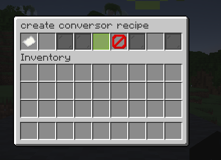
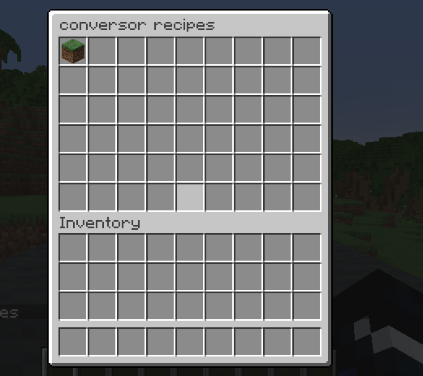

# Conversors

All image credits go to fxuy (Discord contact: fxuyapenas)

## EN
Conversors is my first free plugin! It is made for Spigot servers.  
It allows you to open a menu using a special block, where you can convert one item into another. These conversions are created through in-game menus.

## Plugin Version
1.21

## Dependencies
Supports ItemsAdder

## Commands
- `/conversor-creation`:
    - Opens a menu to create conversion recipes.

- `/conversor-get`:
    - Gives you a default converter block.

- `/conversor-reloadrecipes`:
    - Reloads all recipes.

- `/conversor-recipes`:
    - Opens a menu where you can view and edit all registered recipes.

- `/conversor-reload`:
    - Reloads all plugin configurations and recipes.

## Creating Recipes
When using `/conversor-creation`, a menu will open for you.

Take note of the following items:
- Paper: recipe ID
- Input: empty slot on the left
- Confirm: green panel in the center
- Clear: clears the current recipe, useful if you're editing an existing one
- Output: empty slot on the right

Insert the input item on the left. Regardless of the amount placed, the recipe will register the item with a quantity of 1.  
Insert the recipe ID – this will be the name of the recipe and must be unique. If you use an existing recipe ID, the old one will be replaced.  
Insert the output item on the right – the amount here will be saved.  
Click confirm – the plugin will automatically reload the recipes.

## Viewing Recipes
Use `/conversor-recipes` to open a menu displaying all registered recipes.  
Click on an item in the menu to open its detailed view.

You can delete or edit the recipe.

## Editing Recipes
Use the recipe view menu, click "Edit", then make the desired changes in the menu and click confirm. The recipe will be updated.

## ItemsAdder Support
In `config.yml`, set `items-adder` to `true`.  
Make sure to set `items-adder-block-id` to your furniture’s namespaced ID.  
Note: this only works for furniture blocks.
