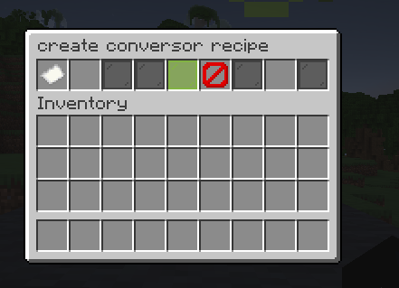
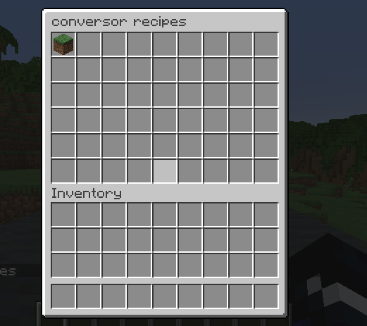
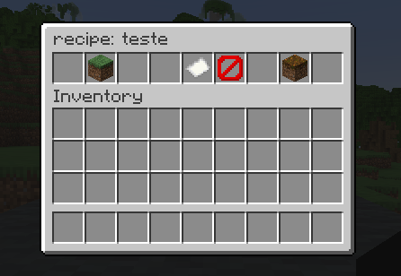

# Conversors

all credits to fxuy to images (discord contact: fxuyapenas)

## Pt-br
Conversors é meu primeiro plugin gratuito! ele é feito para servidores Spigot
Ele permite você com um bloco especial abrir um menu onde pode converter um X item em outro, essas conversões são
criadas a partir de menus ingame.

## Versão do plugin
1.21

## Dependendencias
Possui suporte para itemsAdder

## Comandos
- /conversor-creation:
    - abre um menu de criação de receitas de conversão

- /conversor-get:
    - lhe da um bloco default que é um conversor

- /conversor-reloadrecipes:
    - recarrega todas as receitas

- /conversor-recipes:
    - abre um menu que permite ver todas as receitas cadastradas e as editar

- /conversor-reload:
    - recarrega todas as configurações e receitas do plugin

## Criando receitas
ao usar /conversor-creation um menu se abrirá para você.

Observe os seguintes itens
- papel: id da receita
- input: slot livre da esquerda
- confirmar: painel verde no meio do menu
- limpar: limpa a receita atual, caso você esteja editando uma receita é bem util
- output: slot livre na direita

insirá o item de input na esquerda, independente da quantidade colocada a receita ira cadastrar o Item com a quantidade de 1
Insira o id da receita, esse será o nome da receita e ele deve ser unico, se você usar o nome de uma receita ja existente a receita antiga sera substituida
Insira o item de output na direita, a quantidade aqui é salva
Clique em confirmar, o plugin ira recarregar as receitas automaticamente

## Vendo receitas
Use /conversor-recipes para abrir um menu para ver as receitas, ao clicar em um item no menu, o menu de visualização será aberto

Você pode apagar e editar a receita

## editando receitas
use o menu de visualizar receita, clique em editar e depois mude as coisas no menu clicando em confirmar, a receita será atualizada

## Suporte para itemsAdder
dentro de config.yml mude items-adder para true, lembre-se de colocar em items-adder-block-id o id com namespace da sua furniture, serve apenas para furnitures# Conversors

all credits to fxuy to images (discord contact: fxuyapenas)
